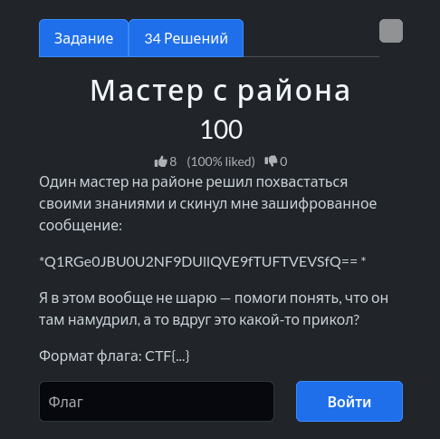
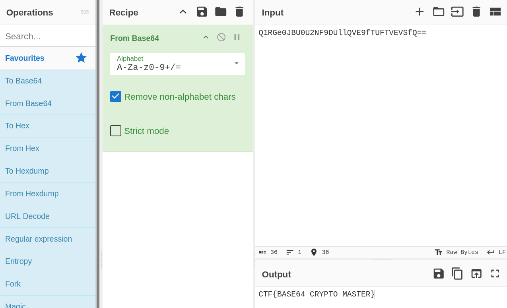

# Задание: Мастер с района

## Решение

Нам дана зашифрованная строка:
`Q1RGe0JBU0U2NF9DUllQVE9fTUFTVEVSfQ==`

По двум символам `=` на конце можно сразу понять, что это шифр **Base64**. Воспользуемся популярным инструментом [CyberChef](https://gchq.github.io/CyberChef/):

1. Выбираем операцию **From Base64**.
2. Копируем данную строку из таски и вставляем в поле **Input**.
3. Забираем готовый флаг из поля **Output**: `CTF{BASE64_CRYPTO_MASTER}`.

---

**Флаг:** `CTF{BASE64_CRYPTO_MASTER}`

**Автор:** [BoCoder](https://t.me/BoCoder_Python) 
**Сообщество:** [Community DailyCTF](https://t.me/+sQe0pGRw9KdlNGI6)