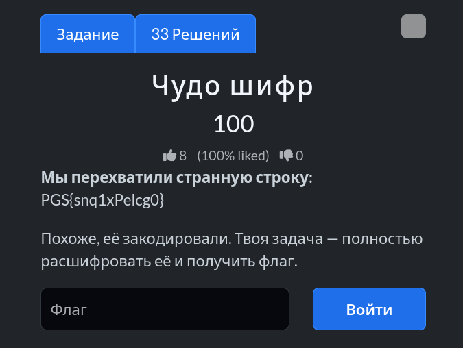
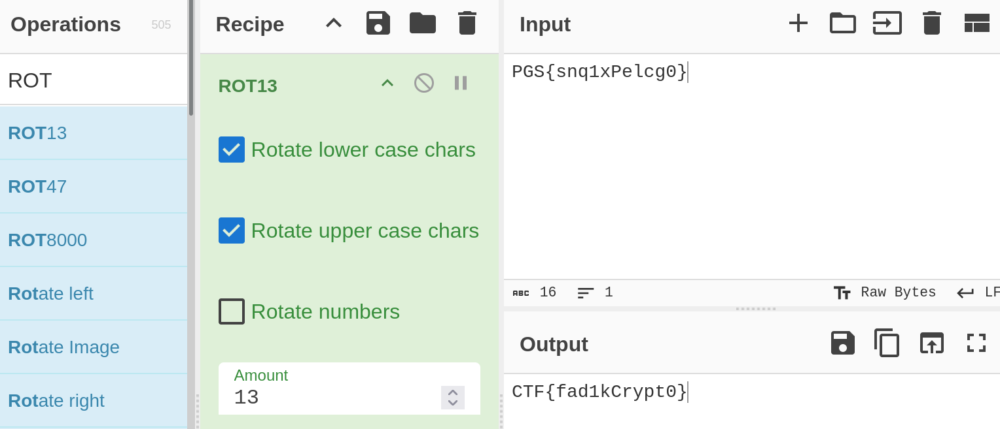

# Задание: Чудо шифр

## Решение

Нам дана зашифрованная строка:
`PGS{snq1xPelcg0}`

По внешнему виду можно предположить, что это классический шифр подстановки — **Шифр Цезаря** (ROT13 / сдвиг алфавита). Воспользуемся популярным инструментом [CyberChef](https://gchq.github.io/CyberChef/):

1. Выбираем операцию **ROT13** (или подбираем сдвиг).
2. Копируем данную строку из таски и вставляем в поле **Input**.
3. Забираем готовый флаг из поля **Output**: `CTF{fad1kCrypt0}`.

---

**Флаг:** `CTF{fad1kCrypt0}`

**Автор:** fadik  
**Сообщество:** [Community DailyCTF](https://t.me/+sQe0pGRw9KdlNGI6)