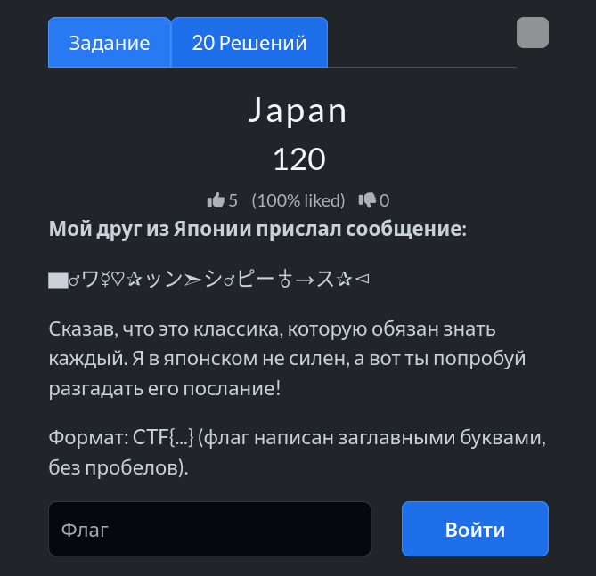
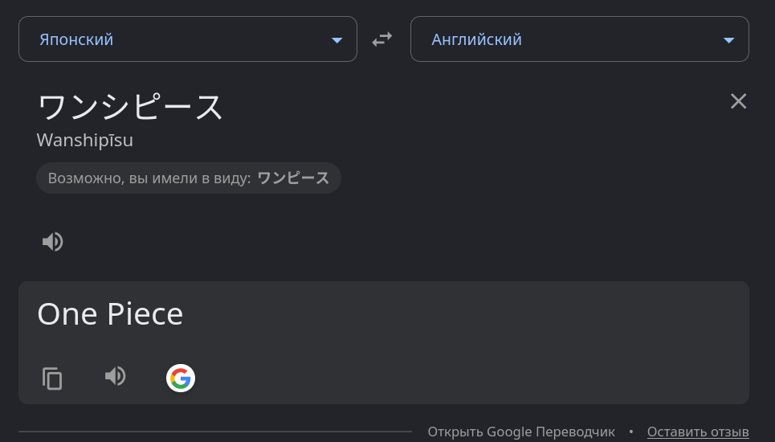

# Задание: Japan

## Решение

Нам дана строка с необычными символами:
`▆♂ワ☿♡✰ッン➣シ♂ピー♁→ス✰◅`

1. Выделяем из этой последовательности нужные знаки (в данном случае японские катаканы и ориентируемся на читаемый текст).
2. Очищаем от лишних символов, в результате получаем: `ワンシピース` (что переводится как *One Piece*).
3. Собираем итоговый флаг по условию задачи: `CTF{ONEPIECE}`.

---

**Флаг:** `CTF{ONEPIECE}`

**Автор:** [BoCoder](https://t.me/BoCoder_Python)  
**Сообщество:** [Community DailyCTF](https://t.me/+sQe0pGRw9KdlNGI6)