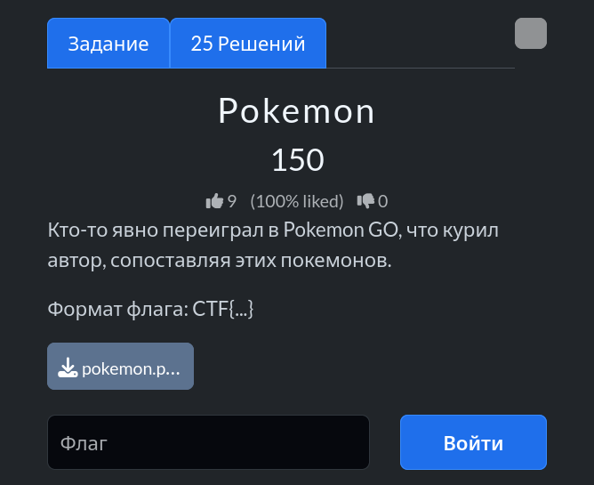

# Задание: Pokemon

## Решение

Нам дано изображение с покемонами и подсказками в верхнем левом углу: флаг России (🇷🇺) и клавиша **Caps Lock**.

Это указывает на то, что названия покемонов нужно брать на **русском языке** и итоговый результат будет состоять из заглавных букв.

1. Анализируем каждого покемона на картинке и определяем его русское название:
   * **П**иджеотто — **П**
   * **И**ви — **И**
   * **К**леффи — **К**
   * **А**мбреон — **А**
   * **Ч**икорита — **Ч**
   * **У**рсаринг — **У**
2. Сопоставляем первые буквы их имён в порядке расположения на изображении.
3. Собираем итоговый флаг по условию задачи: `CTF{ПИКАЧУ}`.

---

**Флаг:** `CTF{ПИКАЧУ}`

**Автор:** [BoCoder](https://t.me/BoCoder_Python)  
**Сообщество:** [Community DailyCTF](https://t.me/+sQe0pGRw9KdlNGI6)