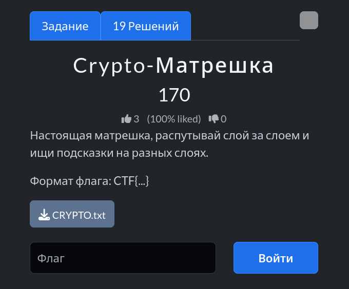
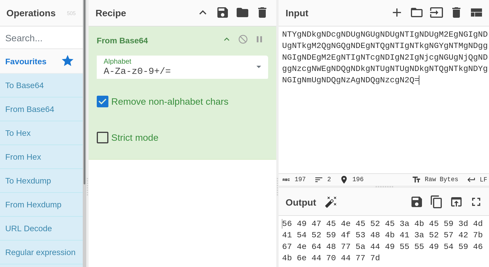
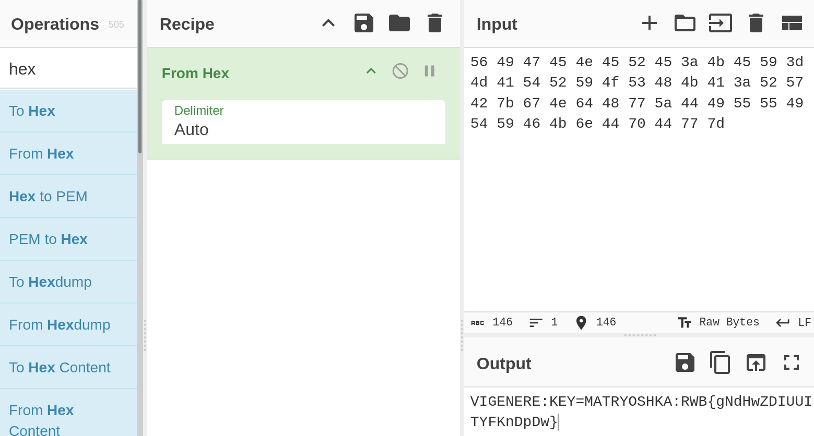
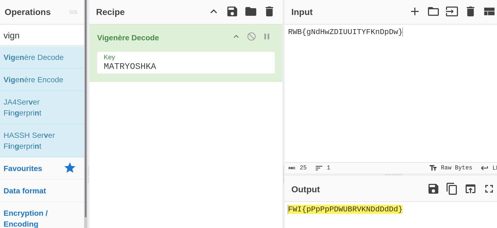
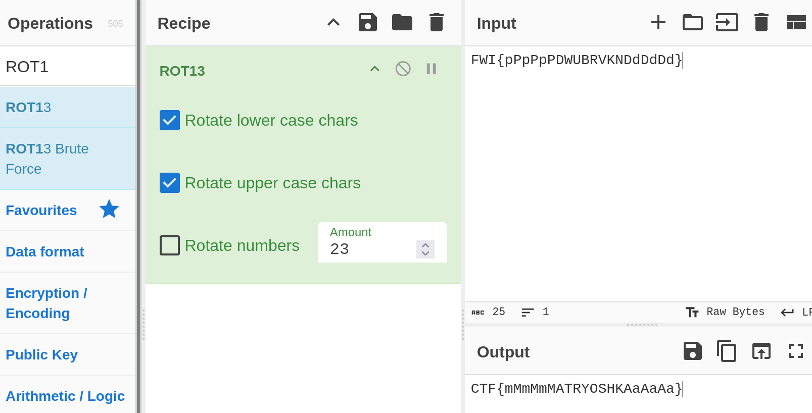

# Задание: Crypto-Матрешка

## Решение

Нам дан текстовый файл с зашифрованным сообщением:
`NTYgNDkgNDcgNDUgNGUgNDUgNTIgNDUgM2EgNGIgNDUgNTkgM2QgNGQgNDEgNTQgNTIgNTkgNGYgNTMgNDggNGIgNDEgM2EgNTIgNTcgNDIgN2IgNjcgNGUgNjQgNDggNzcgNWEgNDQgNDkgNTUgNTUgNDkgNTQgNTkgNDYgNGIgNmUgNDQgNzAgNDQgNzcgN2Q=`

Строка выглядит внушительно, но будем раскрывать слои по очереди, как настоящую матрёшку. Воспользуемся инструментом [CyberChef](https://gchq.github.io/CyberChef/):

### Слой 1: Base64
По символу `=` на конце сразу определяем знакомый кодировщик.
1. Применяем операцию **From Base64**.
2. Вставляем строку в поле **Input**.

На выходе получаем HEX-последовательность:
`56 49 47 45 4e 45 52 45 3a 4b 45 59 3d 4d 41 54 52 59 4f 53 48 4b 41 3a 52 57 42 7b 67 4e 64 48 77 5a 44 49 55 55 49 54 59 46 4b 6e 44 70 44 77 7d`

---

### Слой 2: HEX
1. Добавляем операцию **From Hex**.

Получаем читаемый текст с явной подсказкой:
`VIGENERE:KEY=MATRYOSHKA:RWB{gNdHwZDIUUITYFKnDpDw}`

---

### Слой 3: Шифр Виженера
Текст подсказывает алгоритм и ключ:
* **Шифр:** Vigenere
* **Ключ:** `MATRYOSHKA`

1. Применяем операцию **Vigenere Decode** и передаем ключ.

Получаем промежуточный результат:
`FWI{pPpPpPDWUBRVKNDdDdDd}`

---

### Слой 4: Шифр Цезаря (ROT)
1. Применяем операцию **ROT13** (настраиваем сдвиг на `23`).

Получаем итоговый флаг:
`CTF{mMmMmMATRYOSHKAaAaAa}`

---

**Флаг:** `CTF{mMmMmMATRYOSHKAaAaAa}`

**Автор:** [BoCoder](https://t.me/BoCoder_Python)  
**Сообщество:** [Community DailyCTF](https://t.me/+sQe0pGRw9KdlNGI6)