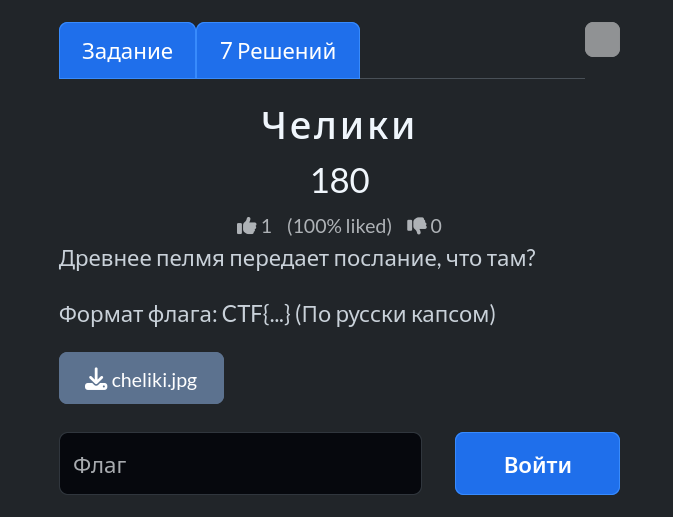
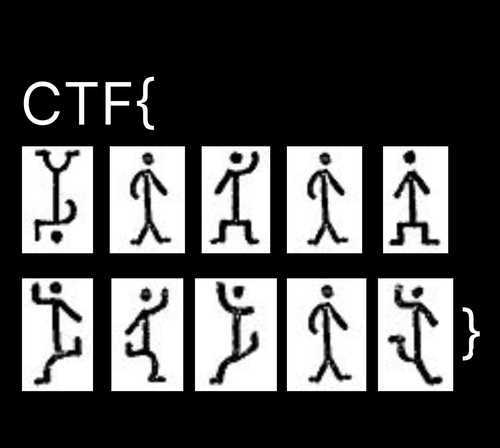
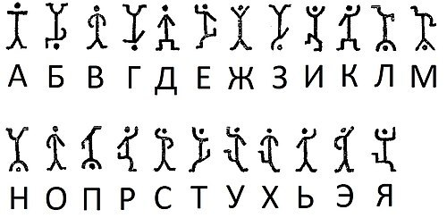

# Задание: Челики

## Решение

Нам дано изображение с зашифрованным посланием, составленным из различных человечков:

1. Для расшифровки находим в открытых источниках таблицу соответствия символов-человечков:
   
2. Последовательно сопоставляем каждого человечка с буквой из таблицы.
3. Собираем итоговое слово и получаем флаг: `CTF{БОКОДЕРТОУ}`.

---

**Флаг:** `CTF{БОКОДЕРТОУ}`

**Автор:** [BoCoder](https://t.me/BoCoder_Python)  
**Сообщество:** [Community DailyCTF](https://t.me/+sQe0pGRw9KdlNGI6)
