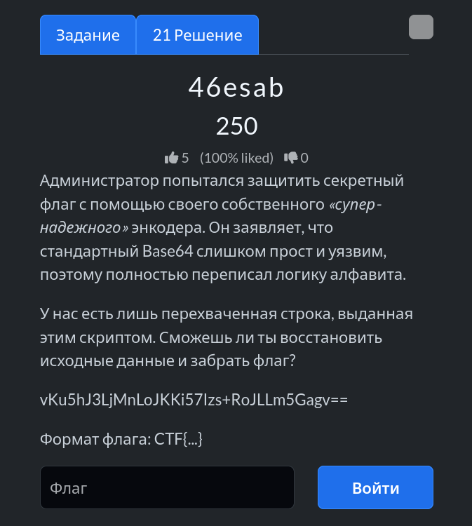

# Задание: 46esab



## Решение

Нам дан зашифрованный флаг:
`vKu5hJ3LjMnLoJKKi57Izs+RoJLLm5Gagv==`

1. **Анализ:** Обратите внимание на название задачи — `46esab` (это прочитанное задом наперед слово `base64`). Это прямой намёк на то, что здесь используется модифицированный Base64 с зеркально инвертированным или изменённым алфавитом.
2. **Скрипт на Python:** Для расшифровки напишем небольшой скрипт с использованием стандартной библиотеки `base64` и заменой стандартного алфавита на перевёрнутый:

```python
import base64

# Зашифрованная строка
encoded_str = "vKu5hJ3LjMnLoJKKi57Izs+RoJLLm5Gagv=="

# Стандартный алфавит Base64 и его зеркальная версия
std_alphabet = "ABCDEFGHIJKLMNOPQRSTUVWXYZabcdefghijklmnopqrstuvwxyz0123456789+/"
rev_alphabet = std_alphabet[::-1]

# Переводим строку из кастомного алфавита в стандартный
trans_table = str.maketrans(rev_alphabet, std_alphabet)
normal_b64 = encoded_str.translate(trans_table)

# Декодируем Base64
flag = base64.b64decode(normal_b64).decode("utf-8")
print(flag)
```

3. **Результат:** Запускаем скрипт и забираем готовый флаг: `CTF{b4s64_muta710n_m4dne}`.

---

**Флаг:** `CTF{b4s64_muta710n_m4dne}`

**Автор:** [BoCoder](https://t.me/BoCoder_Python)  
**Сообщество:** [Community DailyCTF](https://t.me/+sQe0pGRw9KdlNGI6)
