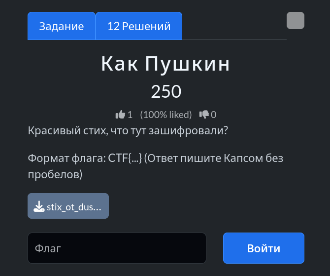

# Задание: Как Пушкин

## Решение

Нам дан текстовый файл со стихотворением `stix_ot_dushi.txt`.

1. **Анализ:** Зашифрованное послание скрыто по диагонали (акростих / лестница): первая буква первой строки, вторая буква второй строки, третья буква третьей строки и так далее.
2. Собираем полученные буквы и получаем имя: `Sarah anna Lewis`.
3. Приводим к формату флага по условиям задачи: `CTF{SARAHANNALEWIS}`.

---

**Флаг:** `CTF{SARAHANNALEWIS}`

**Автор:** [BoCoder](https://t.me/BoCoder_Python)  
**Сообщество:** [Community DailyCTF](https://t.me/+sQe0pGRw9KdlNGI6)
