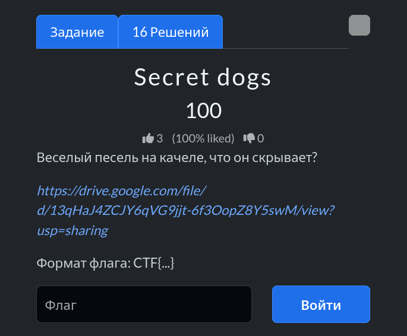
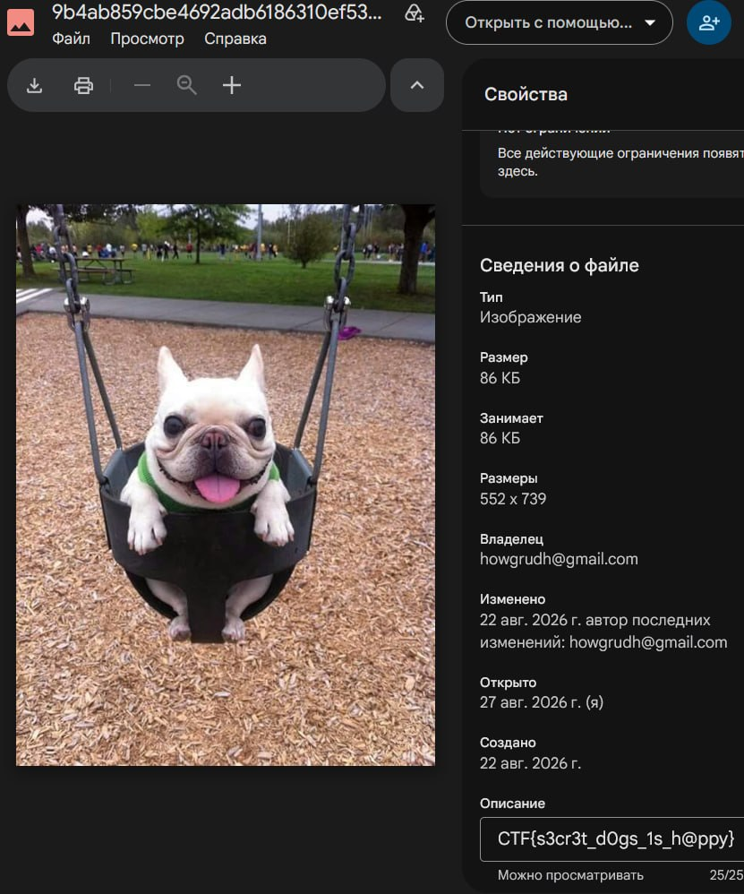

# Задание: Secret dogs

## Решение

Нам дана ссылка на файл в Google Диске: [ссылка](https://drive.google.com/file/d/13qHaJ4ZCJY6qVG9jjt-6f3OopZ8Y5swM/view?usp=sharing).

1. Переходим по ссылке и скачиваем/открываем файл для дальнейшего анализа.
2. Проверяем метаданные файла: заходим в свойства (или проверяем описание/комментарии), где спрятан скрытый текст.
   
3. Копируем найденный флаг из свойств: `CTF{s3cr3t_d0gs_1s_h@ppy}`.

---

**Флаг:** `CTF{s3cr3t_d0gs_1s_h@ppy}`

**Автор:** [BoCoder](https://t.me/BoCoder_Python)  
**Сообщество:** [Community DailyCTF](https://t.me/+sQe0pGRw9KdlNGI6)