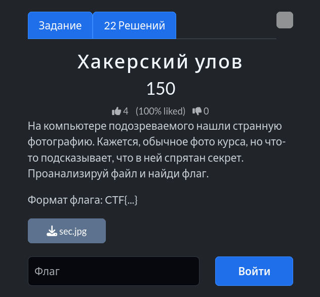
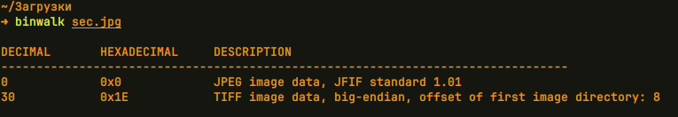
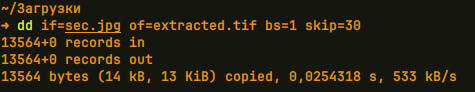
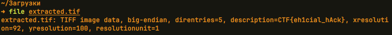

# Задание: Хакерский улов



## Решение

Нам дано изображение в формате JPG:


1. **Анализ структуры:** Запускаем утилиту `binwalk` для поиска скрытых или встроенных данных:
   ```bash
   binwalk sec.jpg
   ```
   
   Видим, что `binwalk` обнаружил внутри файла `sec.jpg` ещё одно изображение формата TIFF, которое расположено со смещением в 30 байт (`0x1E`).

2. **Извлечение данных:** С помощью команды `dd` извлекаем встроенный файл, пропустив первые 30 байт:
   ```bash
   dd if=sec.jpg of=extracted.tif bs=1 skip=30
   ```
   

3. **Проверка результата:** Проверяем тип полученного файла и читаем его метаданные:
   ```bash
   file extracted.tif
   ```
   
   В описании (метаданных) извлечённого файла находим заветный флаг: `CTF{eh1cial_hAck}`.

---

**Флаг:** `CTF{eh1cial_hAck}`

**Автор:** fadik  
**Сообщество:** [Community DailyCTF](https://t.me/+sQe0pGRw9KdlNGI6)
