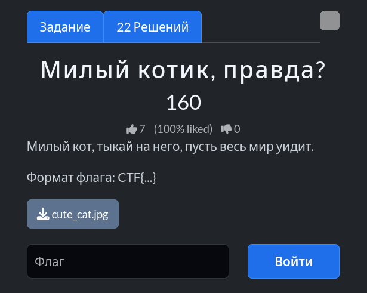
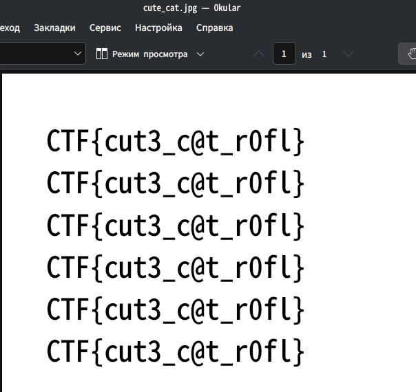

# Задание: Милый котик, правда?

## Решение

Нам дан файл, замаскированный под формат `.jpg`.

1. При попытке стандартного открытия файл выдаёт ошибку загрузки.
2. Проверяем содержимое: если открыть его в текстовом редакторе (или сменив расширение на `.txt`), ошибка пропадает, и внутри файла обнаруживается скрытый текст с флагом.
   
3. Копируем итоговый флаг: `CTF{cut3_c@t_r0fl}`.

---

**Флаг:** `CTF{cut3_c@t_r0fl}`

**Автор:** [BoCoder](https://t.me/BoCoder_Python)  
**Сообщество:** [Community DailyCTF](https://t.me/+sQe0pGRw9KdlNGI6)
