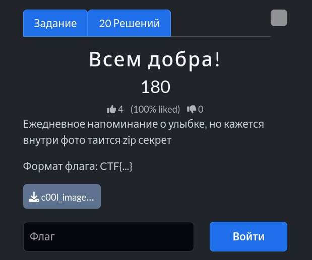
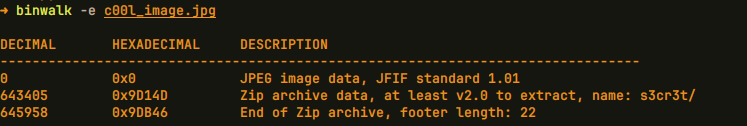
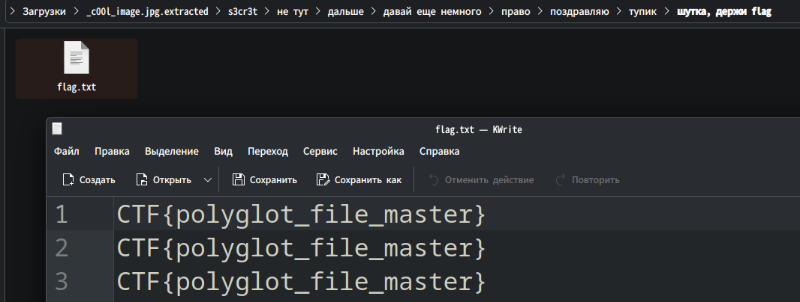

# Задание: Всем добра!



## Решение

Нам дан файл формата `.jpg`, внутри которого спрятан скрытый ZIP-архив.

1. **Анализ структуры:** Запускаем утилиту `binwalk` с ключом `-e` (автоматическое извлечение):
   ```bash
   binwalk -e c00l_image.jpg
   ```
   
   Видим, что внутри обнаружен ZIP-архив (папка `s3cr3t/`).

2. **Поиск флага:** Распаковываем архив. Внутри образуется древовидная структура из множества папок. Последовательно просматриваем их:
   
3. В самом конце находим текстовый файл `flag.txt`, внутри которого и лежит искомый флаг: `CTF{polyglot_file_master}`.

---

**Флаг:** `CTF{polyglot_file_master}`

**Автор:** [BoCoder](https://t.me/BoCoder_Python)  
**Сообщество:** [Community DailyCTF](https://t.me/+sQe0pGRw9KdlNGI6)