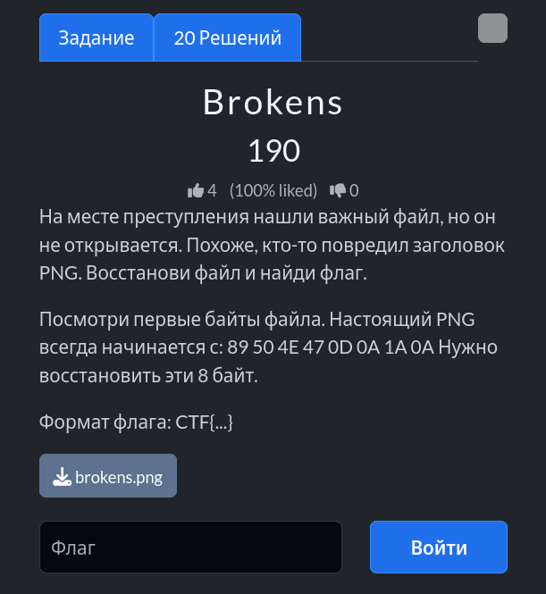
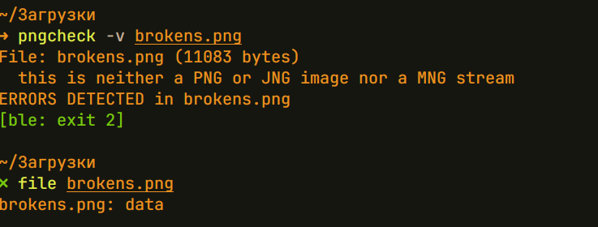
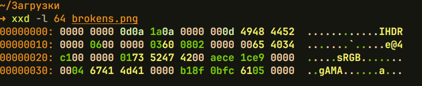
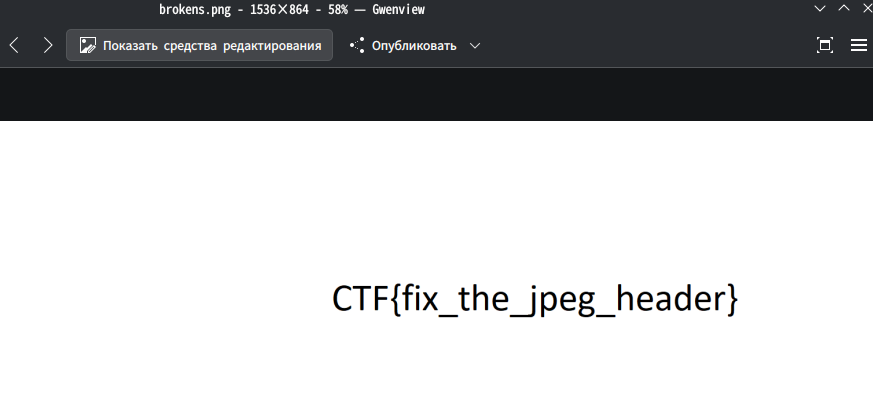

# Задание: Brokens



## Решение

Нам дан повреждённый файл изображения в формате PNG (`brokens.png`).

1. **Анализ:** С помощью утилиты `pngcheck` проверяем структуру файла и получаем ошибку:
   ```bash
   pngcheck -v brokens.png
   ```
   
   Команда `file brokens.png` также выдаёт неопределённый результат (`data`).

2. **Проверка сигнатуры:** Проверяем шестнадцатеричные заголовки файла через утилиту `xxd`:
   ```bash
   xxd -l 64 brokens.png
   ```
   
   Видим, что первые 4 байта повреждены: вместо стандартной сигнатуры PNG (`89 50 4E 47`) записаны нули (`00 00 00 00`). Остальные заголовки (`IHDR`, `sRGB`, `gAMA`) целы, поэтому утилита и выдавала ошибку.

3. **Восстановление:** Восстанавливаем правильную сигнатуру PNG с помощью команды `printf` и `dd`:
   ```bash
   printf '\x89\x50\x4e\x47' | dd conv=notrunc of=brokens.png bs=1 count=4
   ```

4. **Проверка результата:** После починки сигнатуры файл открывается корректно, и на изображении мы забираем флаг: `CTF{fix_the_jpeg_header}`.
   

---

**Флаг:** `CTF{fix_the_jpeg_header}`

**Автор:** fadik  
**Сообщество:** [Community DailyCTF](https://t.me/+sQe0pGRw9KdlNGI6)