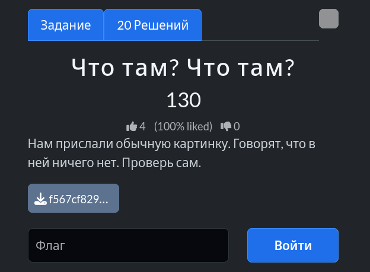

# Задание: Что там? Что там?



## Решение

Нам дан файл изображения в формате `.jpg`, в котором спрятан скрытый текст.

1. **Анализ:** Используем утилиту `strings`, чтобы извлечь всю читаемую последовательность символов из файла:
   ```bash
   strings f567cf829626e526b303d862392ff253.jpg
   ```
2. Просматриваем длинный вывод служебных данных, метаданных и бинарного мусора.
3. В самом конце вывода находим заветный флаг, который оставили в хвосте файла:
   ```text
   CTF{look_at_the_end_of_the_file}
   ```

---

**Флаг:** `CTF{look_at_the_end_of_the_file}`

**Автор:** fadik  
**Сообщество:** [Community DailyCTF](https://t.me/+sQe0pGRw9KdlNGI6)
