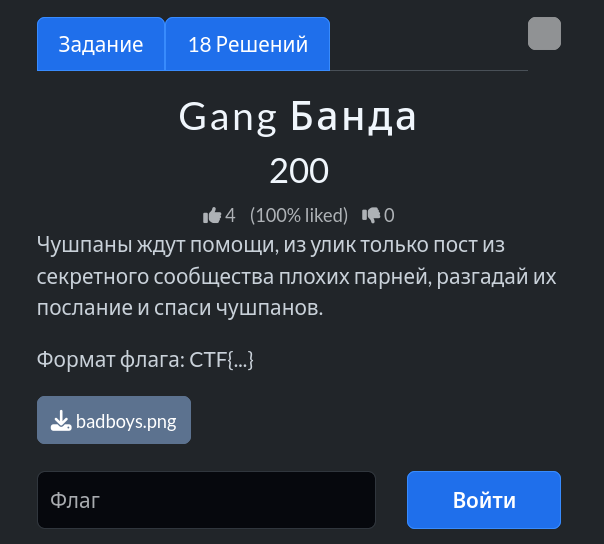
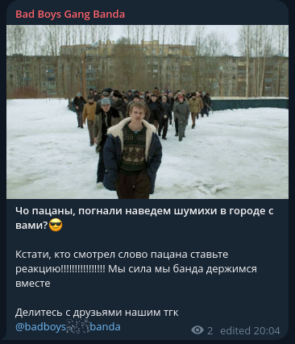
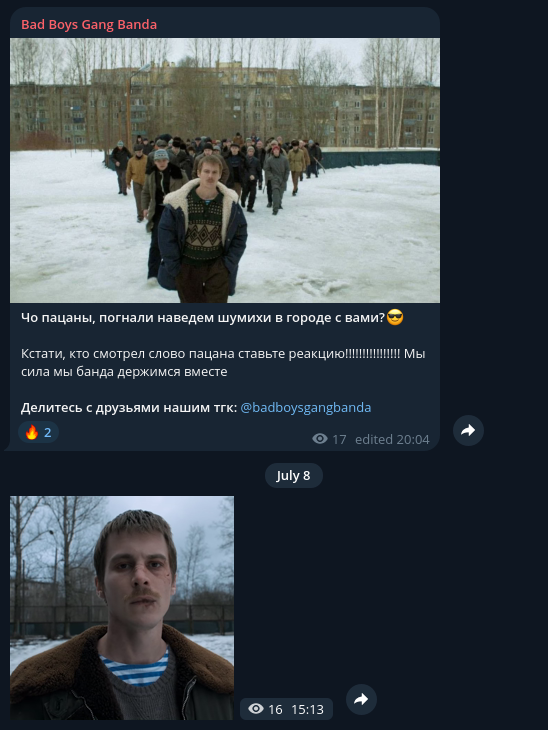
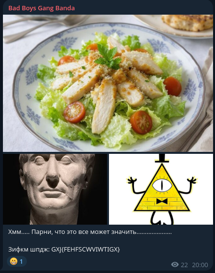
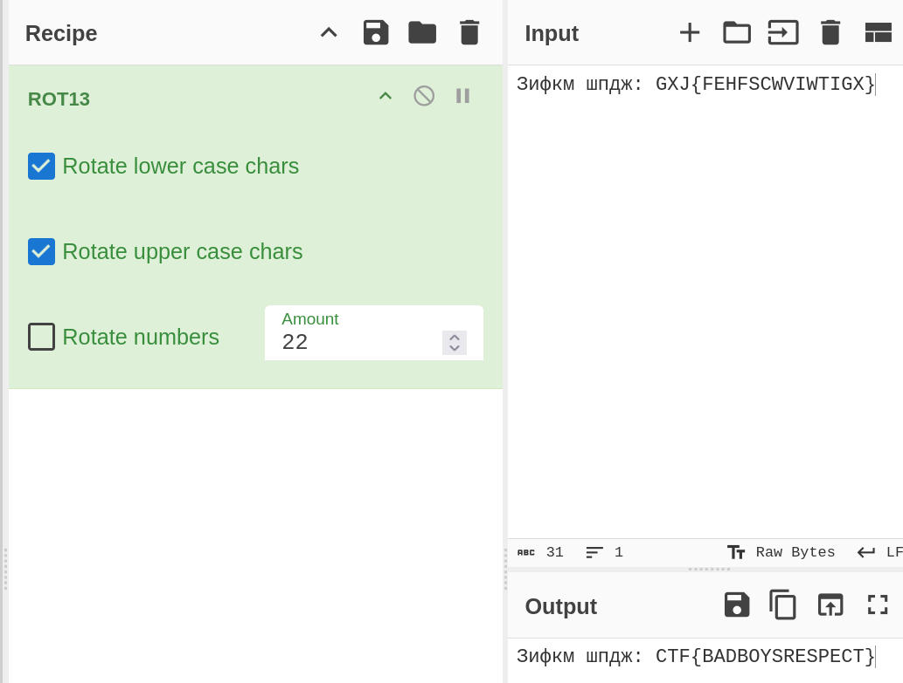

# Задание: Gang Банда

## Решение

Нам дано изображение с постом из Telegram-канала:

1. **Анализ:** Изучаем скриншот и находим название Telegram-канала — *Bad Boys Gang Banda*.
2. Находим этот канал в Telegram по юзернейму `@badboysgangbanda`:
   
3. Листаем ленту чуть ниже и находим нужный пост. На изображении изображен салат «Цезарь», что служит прямой подсказкой на **шифр Цезаря**. Рядом опубликован зашифрованный текст:  
   `Зифкм шпдж: GXJ{FEHFSCWVIWTIGX}`
   
4. Переходим в [CyberChef](https://gchq.github.io/CyberChef/) и применяем операцию **ROT13** (подбираем сдвиг):
   
   Получаем расшифрованный флаг: `CTF{BADBOYSRESPECT}`.

---

**Флаг:** `CTF{BADBOYSRESPECT}`

**Автор:** [BoCoder](https://t.me/BoCoder_Python)  
**Сообщество:** [Community DailyCTF](https://t.me/+sQe0pGRw9KdlNGI6)