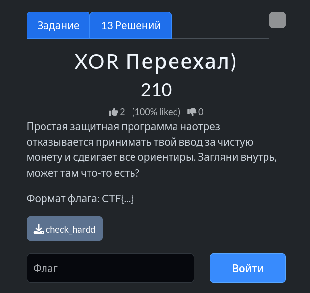
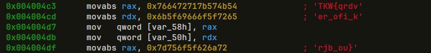
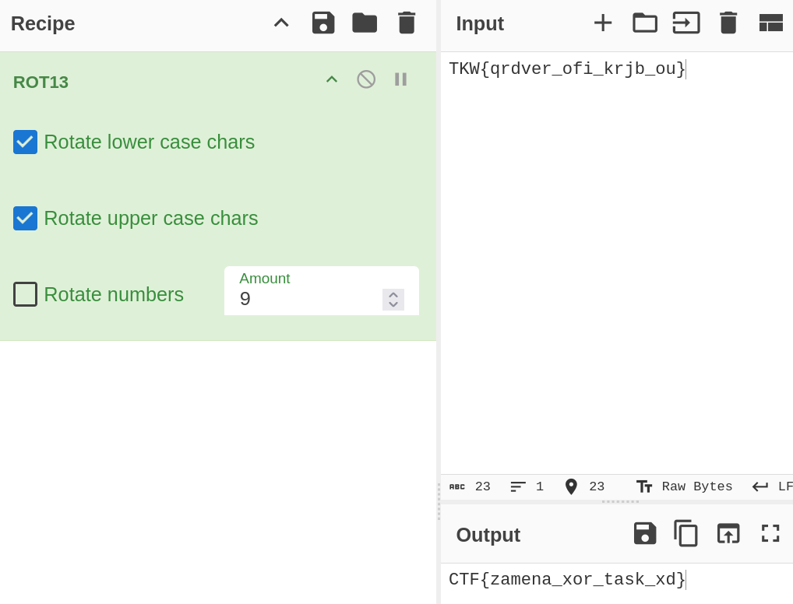

# Задание: XOR Переехал



## Решение

Нам дан скомпилированный бинарный файл `check_hardd`.

1. **Анализ бинарника:** Исследуем скомпилированный файл с помощью консольного реверс-инженерного фреймворка `rizin`:
   ```bash
   rizin check_hardd
   ```
   Внутри интерактивной консоли переходим к функции `main` с помощью команды декомпиляции/дизассемблирования (`pdf @ main`):
   ```text
   [0x004003b0]> pdf @ main
   ```
   
   Изучая листинг функции, обнаруживаем захардкоженную зашифрованную строку / массив: `TKW{qrdver_ofi_krjb_ou}`.

2. **Расшифровка:** Переходим в [CyberChef](https://gchq.github.io/CyberChef/) и применяем операцию **ROT13** (классический шифр подстановки / сдвига со сдвигом 13):
   

3. На выходе получаем расшифрованный флаг: `CTF{zamena_xor_task_xd}`.

---

**Флаг:** `CTF{zamena_xor_task_xd}`

**Автор:** [BoCoder](https://t.me/BoCoder_Python)  
**Сообщество:** [Community DailyCTF](https://t.me/+sQe0pGRw9KdlNGI6)
