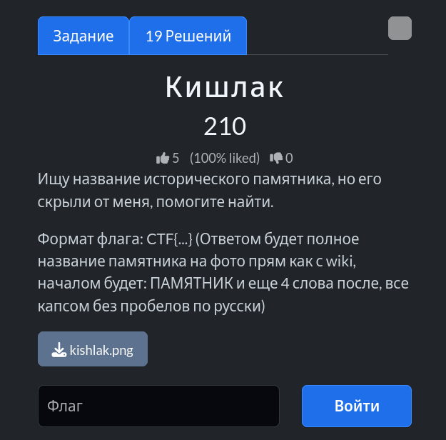
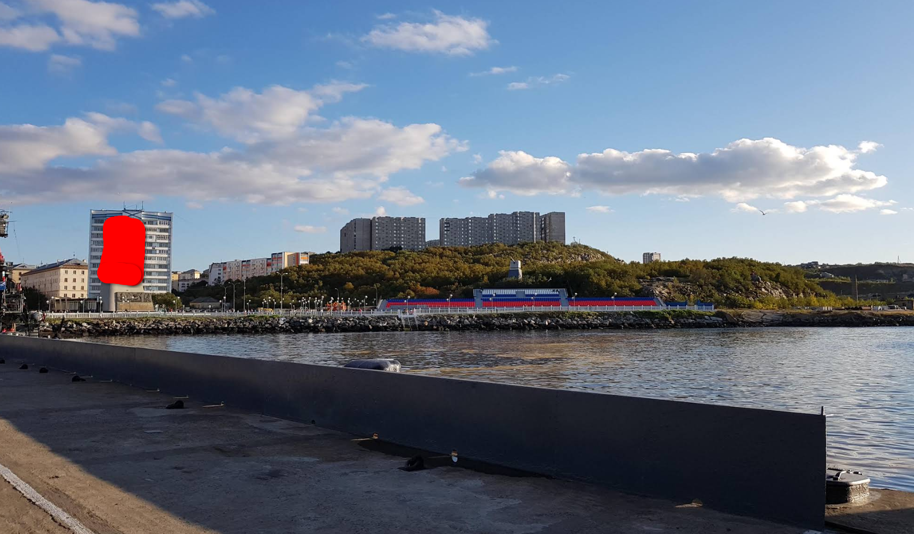
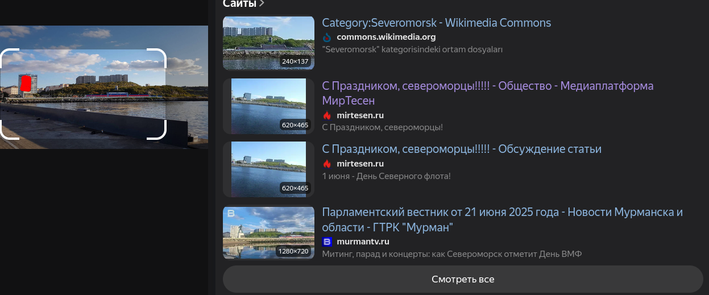
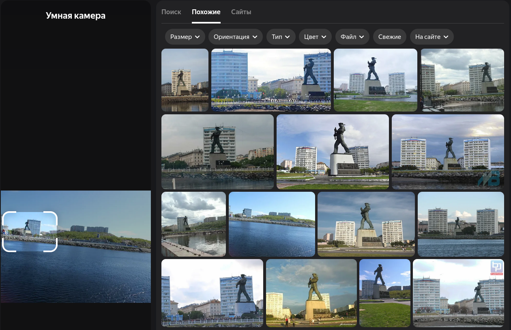
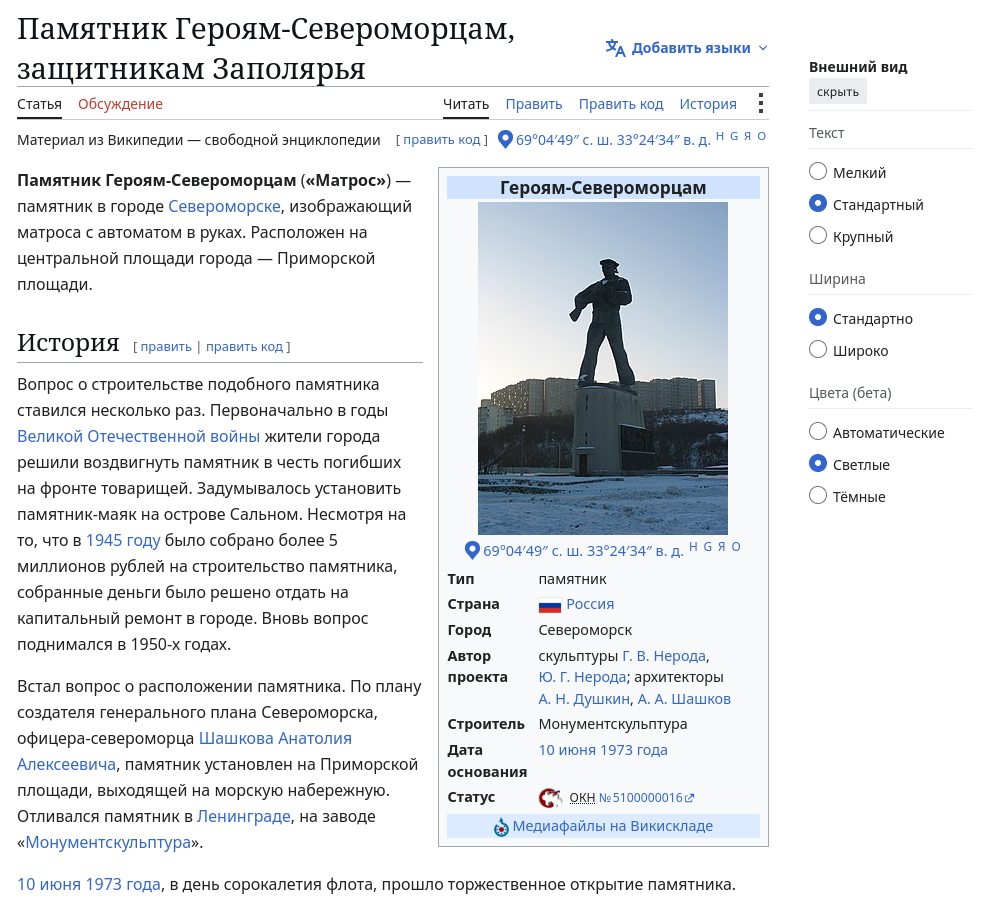

# Задание: Кишлак

## Решение

**Нам дано изображение:**

1. **Поиск:** Скачиваем изображение и загружаем его в визуальный поисковик (например, Яндекс.Картинки). Поисковая система быстро находит похожие кадры, включая фотографии того же места с другого ракурса:
   
2. Берем найденный более информативный кадр с четким видом памятника и снова отправляем его в поиск по картинкам, чтобы узнать точное название мемориала:
   
3. Находим статью на Wikipedia и переводим название памятника в требуемый по условиям формат (без пробелов, на русском языке в верхнем регистре):
   
   Получаем итоговый флаг: `CTF{ПАМЯТНИКГЕРОЯМСЕВЕРОМОРЦАМЗАЩИТНИКАМЗАПОЛЯРЬЯ}`.

---

**Флаг:** `CTF{ПАМЯТНИКГЕРОЯМСЕВЕРОМОРЦАМЗАЩИТНИКАМЗАПОЛЯРЬЯ}`

**Автор:** [BoCoder](https://t.me/BoCoder_Python)  
**Сообщество:** [Community DailyCTF](https://t.me/+sQe0pGRw9KdlNGI6)