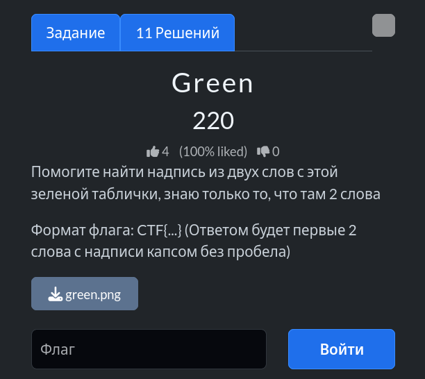
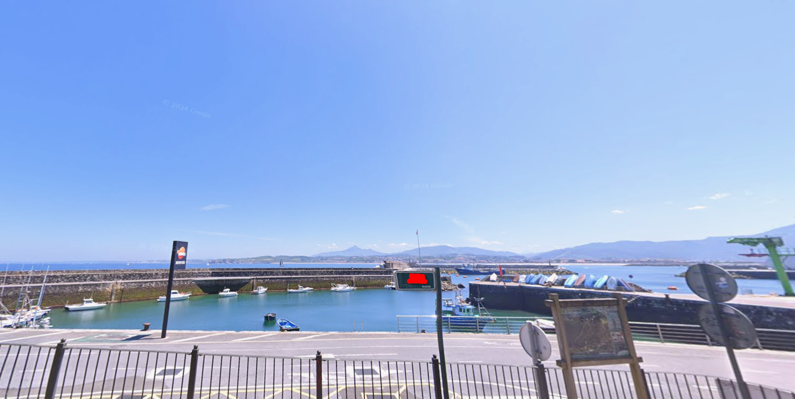
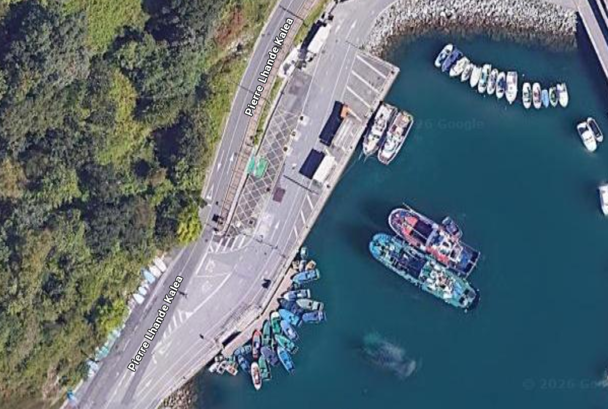
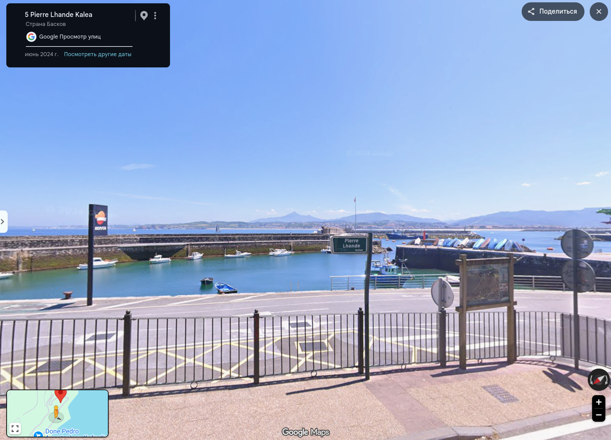

# Задание: Green

## Решение

**Нам дано изображение:**

1. **Анализ:** Изучаем детали на фотографии. На снимке видны живописные горы и заправка с вывеской бренда *Repsol*. На дорожном указателе частично читается слово **«kalea»**. На баскском языке (официальном языке Страны Басков в Испании) оно означает «улица», что сужает область поиска до этого региона.
2. **Поиск:** Используя спутниковые карты и геоданные, ищем улицу со словом *kalea*, расположенную рядом с живописной бухтой или заливом:
   
3. Находим точную локацию — улицу **Pierre Lhande Kalea**, которая проходит у побережья:
   
4. Согласно условиям задачи, собираем флаг из двух слов (без пробелов, латиницей в верхнем регистре): `CTF{PIERRELHANDE}`.

---

**Флаг:** `CTF{PIERRELHANDE}`

**Автор:** [BoCoder](https://t.me/BoCoder_Python)  
**Сообщество:** [Community DailyCTF](https://t.me/+sQe0pGRw9KdlNGI6)