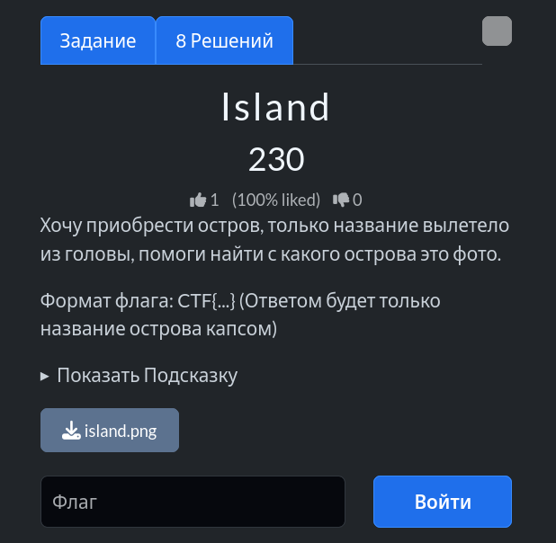
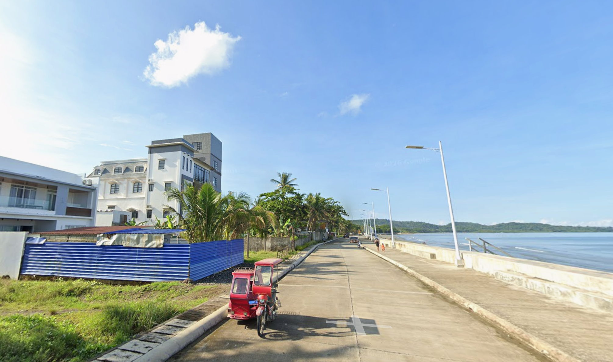
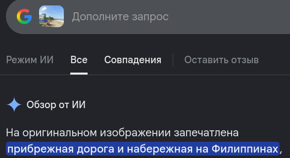

# Задание: Island

## Решение

**Нам дано изображение:**

1. **Поиск:** Используем Google Lens, чтобы определить примерную географическую локацию. Сервис указывает на Филиппины:
   
2. В результатах поиска находим правительственный сайт Филиппин с новостями и проектами [PIA News](https://pia.gov.ph/news/completed-seawall-project-in-romblon-benefits-coastal-community/). Изучая материалы и сопоставляя детали береговой линии с исходным фото, локализуем нужный остров — это **Таблас** (*Tablas*, точные координаты: `12.408338, 121.9880948`).
3. Согласно условиям задачи, собираем итоговый флаг: `CTF{TABLAS}`.

---

**Флаг:** `CTF{TABLAS}`

**Автор:** [BoCoder](https://t.me/BoCoder_Python)  
**Сообщество:** [Community DailyCTF](https://t.me/+sQe0pGRw9KdlNGI6)
