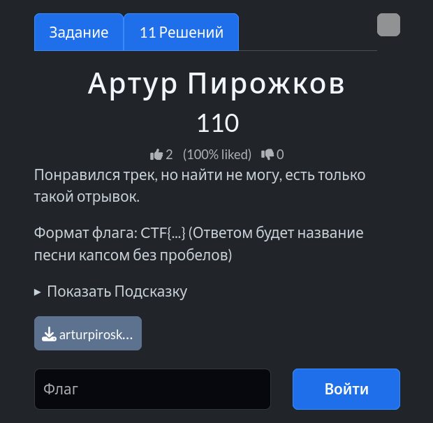

# Задание: Артур Пирожков

## Решение

Нам дан короткий аудиоотрывок трека длительностью всего 4 секунды.

1. **Поиск:** Загружаем или проигрываем этот семпл через популярный сервис распознавания музыки [Shazam](https://www.shazam.com/ru-ru).
2. [Shazam](https://www.shazam.com/ru-ru) успешно находит композицию. Согласно условиям задачи, названием трека для флага является песня группы Panchiko — *Kicking Cars*.
3. Форматируем название по условию (капсом и без пробелов) и получаем итоговый флаг: `CTF{KICKINGCARS}`.

---

**Флаг:** `CTF{KICKINGCARS}`

**Автор:** [BoCoder](https://t.me/BoCoder_Python)  
**Сообщество:** [Community DailyCTF](https://t.me/+sQe0pGRw9KdlNGI6)
