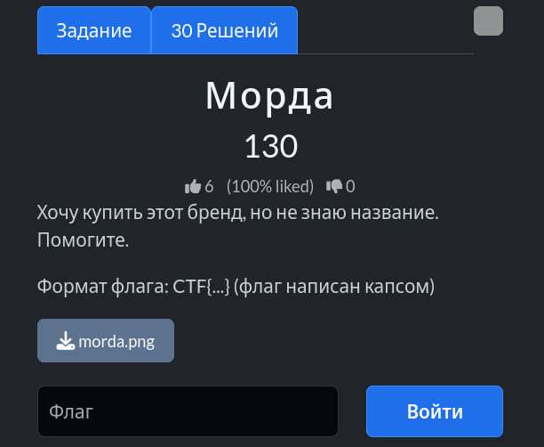
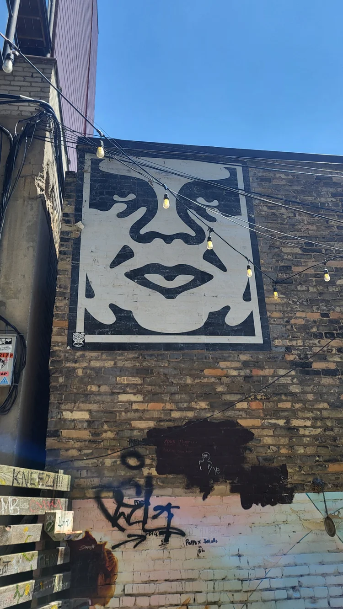
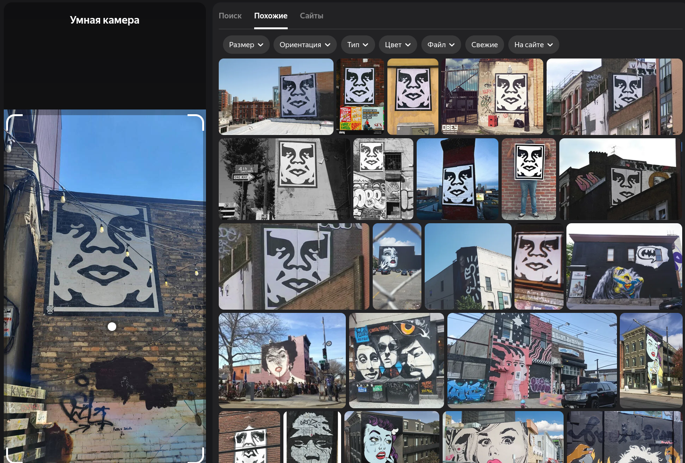

# Задание: Морда

## Решение

**Нам дано изображение:**

1. **Поиск:** Чтобы узнать, что за логотип или бренд изображен на картинке, используем визуальный поиск (например, Яндекс.Картинки или Google Lens):
   
   Система выдает множество похожих результатов.
2. **Анализ:** Переходим по одному из совпадений и определяем бренд — это культовый стритвир-бренд **OBEY**:
   
3. Согласно условиям задачи, собираем итоговый флаг: `CTF{OBEY}`.

---

**Флаг:** `CTF{OBEY}`

**Автор:** [BoCoder](https://t.me/BoCoder_Python)  
**Сообщество:** [Community DailyCTF](https://t.me/+sQe0pGRw9KdlNGI6)