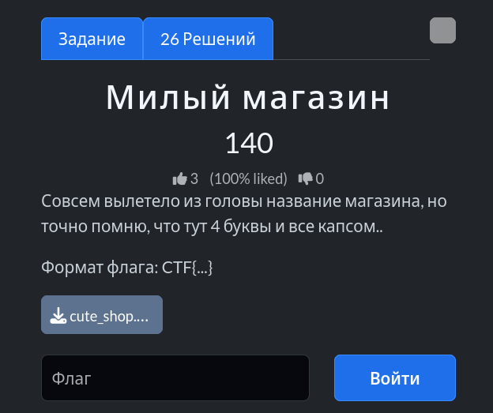
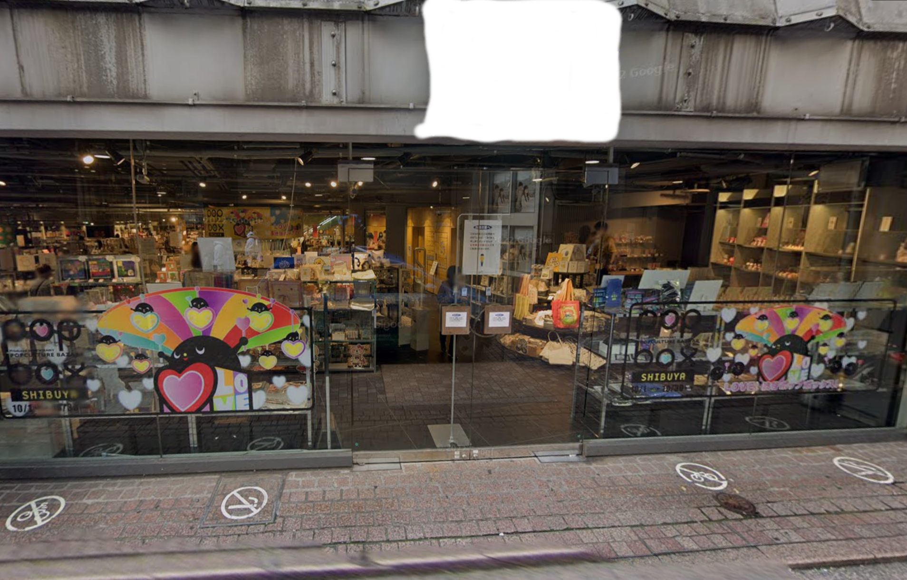
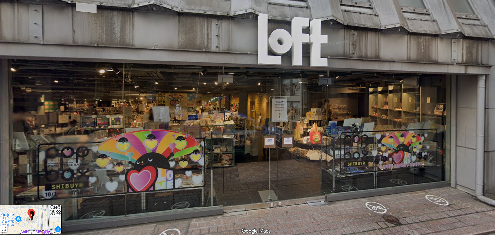

# Задание: Милый магазин

## Решение

**Нам дано изображение:**

1. **Поиск:** Чтобы узнать точное место или название магазина, изображенного на фотографии, используем визуальный поиск (Яндекс.Картинки, Google Lens), анализируя вывески, ассортимент и характерные детали фасада.
2. Поисковые сервисы быстро находят локацию — это популярный японский универмаг **Loft** (точные координаты: `35.6608839, 139.6997538`):
   
3. Согласно условиям задачи, собираем итоговый флаг: `CTF{LOFT}`.

---

**Флаг:** `CTF{LOFT}`

**Автор:** [BoCoder](https://t.me/BoCoder_Python)  
**Сообщество:** [Community DailyCTF](https://t.me/+sQe0pGRw9KdlNGI6)
