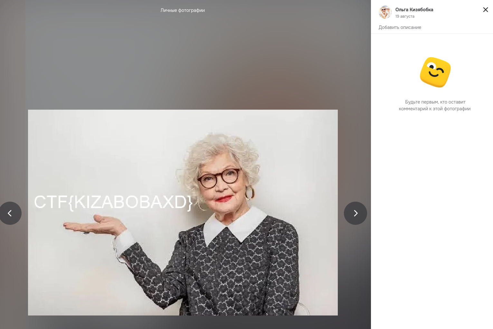

# Задание: Бабуля

## Решение

**Нам дано описание:**
> Помогите найти мою бабулю в одной популярной социальной сети для нее. Звать ее: Ольга Кизябобка, только так. У нее на стене есть то, что нам всем нужно...

1. **Поиск:** Ориентируясь на описание, определяем целевую платформу — социальную сеть «Одноклассники».
2. Через поисковую систему соцсети ищем пользователя по точному имени: *Ольга Кизябобка*, и переходим на найденный профиль:
   
3. Изучаем профиль и личные фотографии пользователя, где находим нужный снимок с спрятанным флагом:
   
4. Забираем итоговый флаг из описания или с картинки: `CTF{KIZABOBAXD}`.

---

**Флаг:** `CTF{KIZABOBAXD}`

**Автор:** [BoCoder](https://t.me/BoCoder_Python)  
**Сообщество:** [Community DailyCTF](https://t.me/+sQe0pGRw9KdlNGI6)