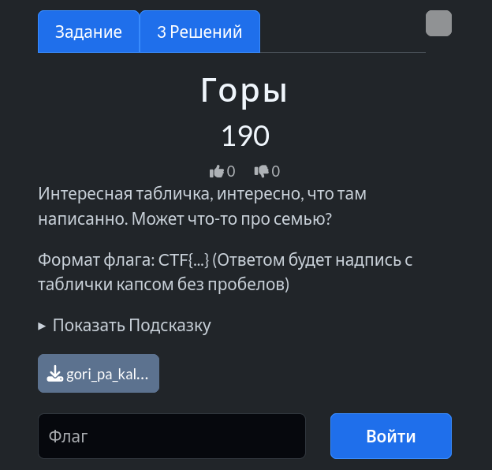
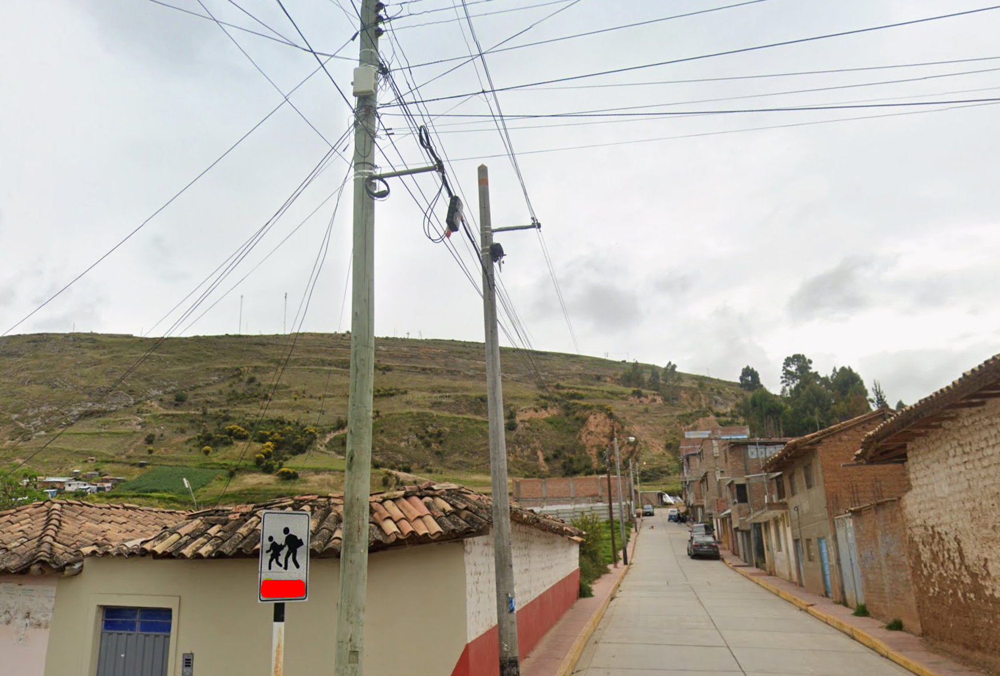
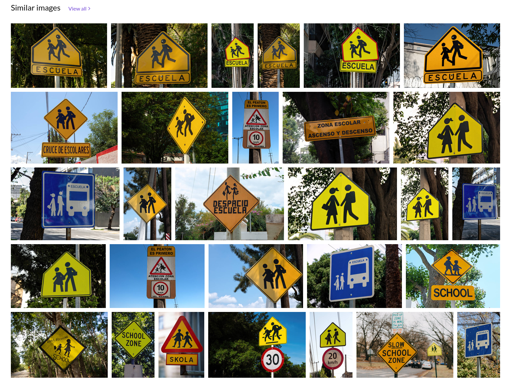
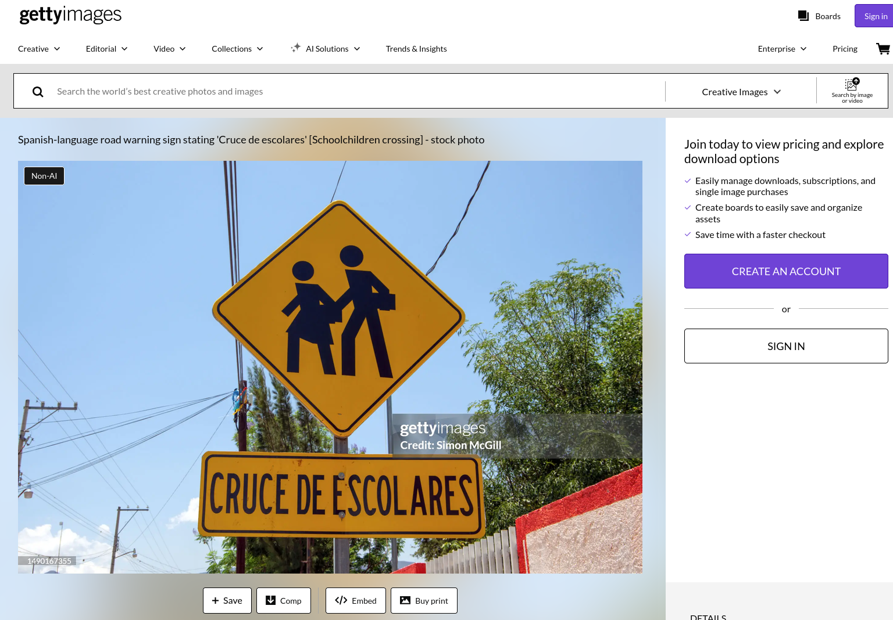

# Задание: Горы

## Решение

**Нам дано изображение:**

1. **Анализ:** Наша задача — восстановить текст с размытого дорожного знака на фотографии. По характерному ландшафту и деталям определяем регион (Перу), где на дорожных знаках используется испанский язык.
2. **Поиск:** Ищем дорожные предупреждающие знаки в Перу (например, связанные со школами, детьми или пешеходными переходами). По поисковому запросу находим сток-фотографии с примерами таких знаков ([Getty Images](https://www.gettyimages.com/detail/photo/spanish-language-road-warning-sign-stating-zona-royalty-free-image/1348230806)):
   
3. Проверяем варианты надписей. Второй вариант знака ([ссылка на Getty Images](https://www.gettyimages.com/detail/photo/spanish-language-road-warning-sign-stating-cruce-de-royalty-free-image/1490167355)) нам подходит:
   
4. Получаем фразу на испанском: `CRUCE DE ESCOLARES`.
Оформляем итоговый флаг по условиям задачи (без пробелов, капсом): `CTF{CRUCEDEESCOLARES}`.

---

**Флаг:** `CTF{CRUCEDEESCOLARES}`

**Автор:** [BoCoder](https://t.me/BoCoder_Python)  
**Сообщество:** [Community DailyCTF](https://t.me/+sQe0pGRw9KdlNGI6)
