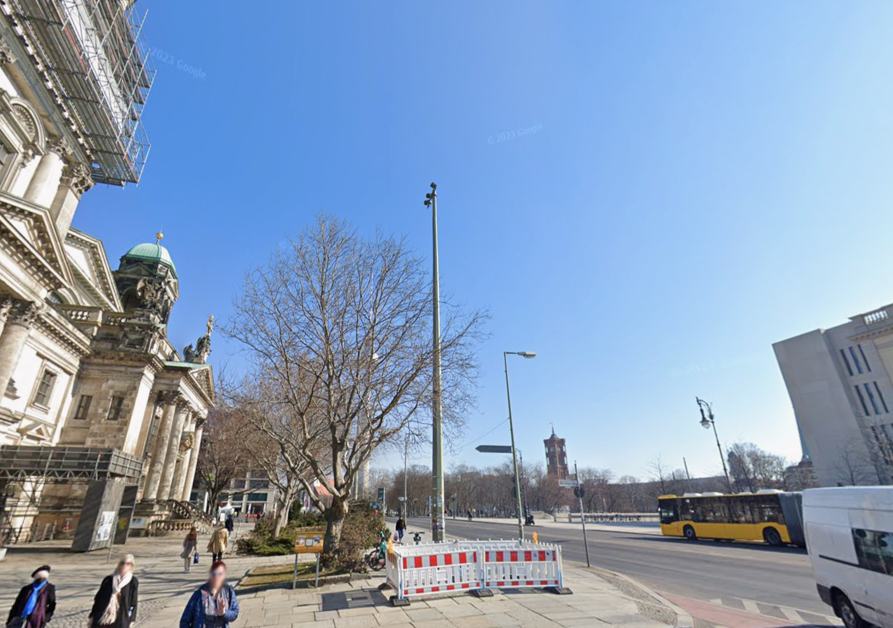
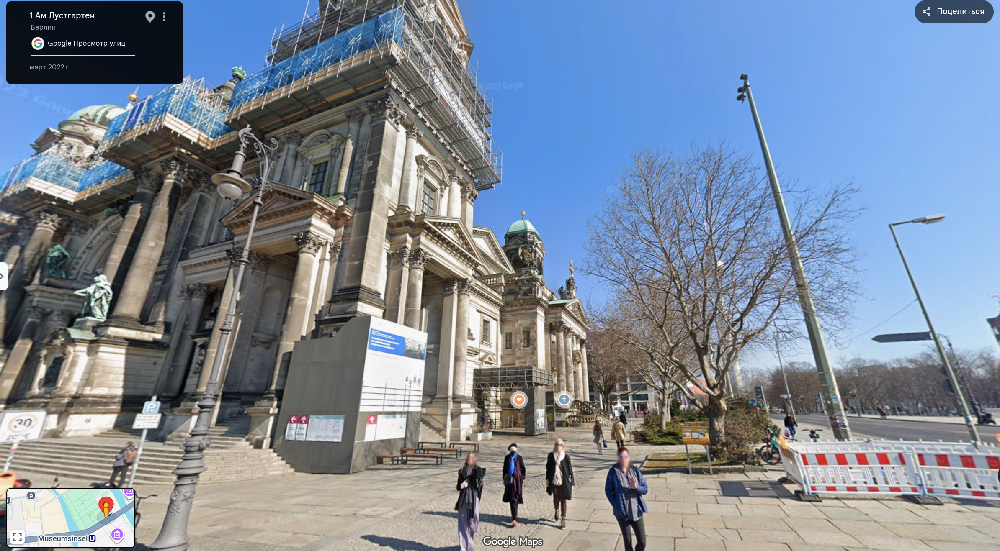

# Задание: Где я?

## Решение

**Нам дано изображение:**

1. **Анализ:** На фотографии узнается характерная немецкая архитектура и купол Берлинского кафедрального собора (*Berliner Dom*). С помощью визуального поиска (Яндекс.Картинки или Google Lens) быстро определяем точную достопримечательность.
2. **Поиск:** Сопоставляем ракурс со снимками со спутника и панорамами карт, чтобы найти точку съемки:
   
3. Вычисляем адрес, с которого было сделано фото — **Am Lustgarten 1**.
4. Оформляем итоговый флаг согласно условиям задачи (без пробелов, латиницей в верхнем регистре): `CTF{AMLUSTGARTEN1}`.

---

**Флаг:** `CTF{AMLUSTGARTEN1}`

**Автор:** [BoCoder](https://t.me/BoCoder_Python)  
**Сообщество:** [Community DailyCTF](https://t.me/+sQe0pGRw9KdlNGI6)
