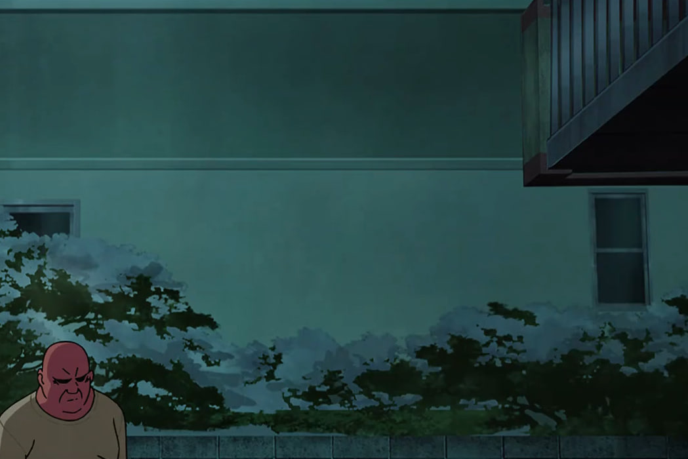

# Задание: Anime

## Решение

**Нам дано изображение:**

1. **Анализ:** Перед нами скриншот из аниме. Чтобы найти точный номер эпизода по кадру, используем специализированный сервис поиска аниме по фото: [trace.moe](https://trace.moe/).
2. Загружаем изображение на сайт. Система производит сканирование и выдает точное совпадение:
   
3. Определяем нужный номер серии — **241**. Согласно условиям задачи, собираем итоговый флаг: `CTF{241}`.

---

**Флаг:** `CTF{241}`

**Автор:** [BoCoder](https://t.me/BoCoder_Python)  
**Сообщество:** [Community DailyCTF](https://t.me/+sQe0pGRw9KdlNGI6)