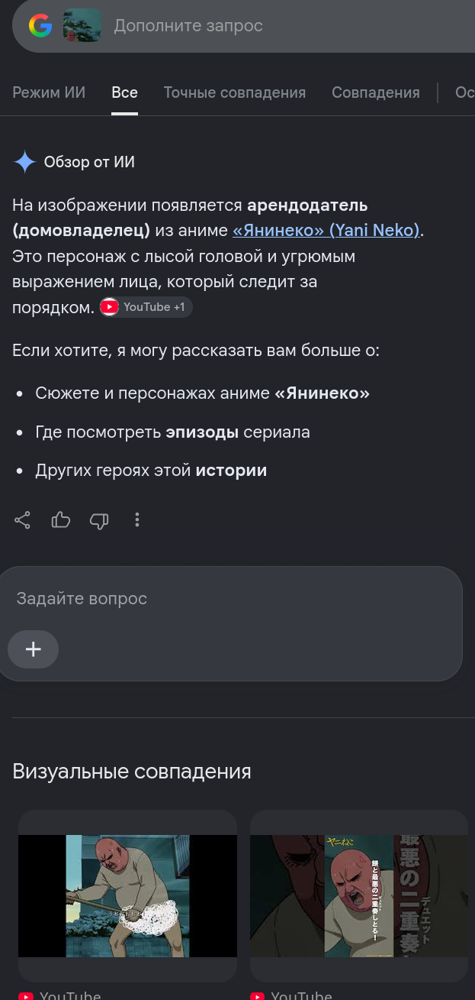
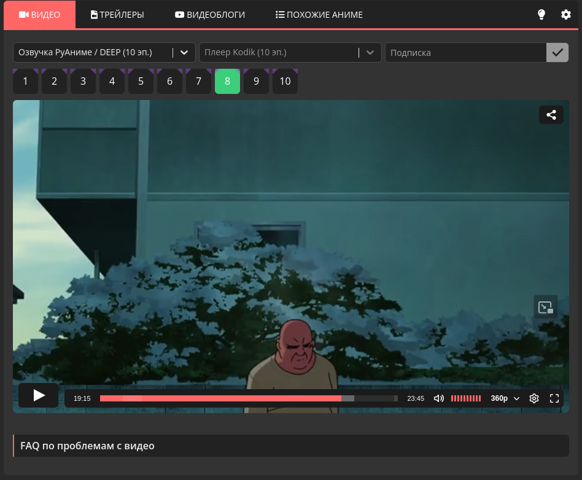

# Задание: Anime X2

## Решение

**Нам дано изображение:**

1. **Анализ:** Перед нами скриншот из аниме. Базовый сервис [trace.moe](https://trace.moe/) в этот раз не справляется (аниме относительно новое, и кадр еще не проиндексирован в базе).
2. **Поиск:** Воспользуемся Google Lens. Инструмент сразу же определяет проект — это аниме «Табакошка» (*Yani Neko*):
   
   На момент создания таски вышло всего 9 серий. Быстро просматриваем их, чтобы найти нужный эпизод.
3. Находим точное совпадение кадра в 8-й серии ([ссылка на каталог YummyAnime](https://old.yummyani.me/catalog/item/tabakoshka)):
   
4. Номер нужного эпизода — **8**. Согласно условиям задачи, собираем итоговый флаг: `CTF{8}`.

---

**Флаг:** `CTF{8}`

**Автор:** [BoCoder](https://t.me/BoCoder_Python)  
**Сообщество:** [Community DailyCTF](https://t.me/+sQe0pGRw9KdlNGI6)