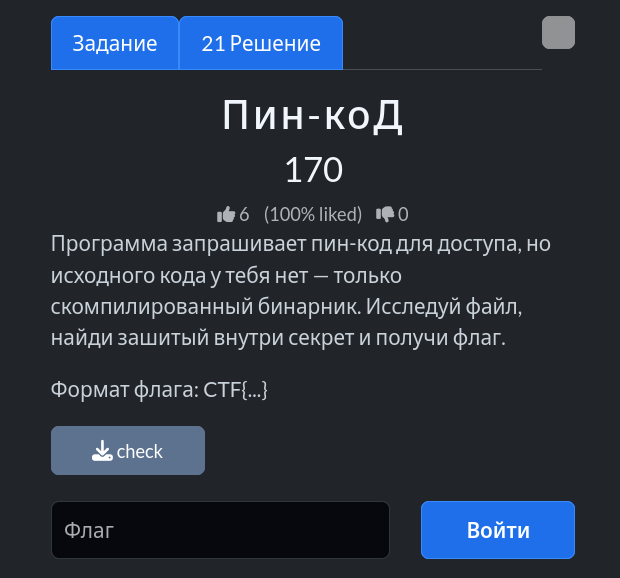
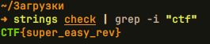

# Задание: Пин-коД



## Решение

Нам дан скомпилированный бинарный файл `check`.

1. **Анализ бинарника:** Скачиваем файл и используем стандартную утилиту `strings` в связке с `grep`, чтобы извлечь из бинарного файла все читаемые строки и отфильтровать их по ключевому слову `ctf`:
   ```bash
   strings check | grep -i "ctf"
   ```
2. В результате выполнения команды получаем захардкоженную строку с флагом:
   

Вывод: `CTF{super_easy_rev}`.

---

**Флаг:** `CTF{super_easy_rev}`

**Автор:** [BoCoder](https://t.me/BoCoder_Python)  
**Сообщество:** [Community DailyCTF](https://t.me/+sQe0pGRw9KdlNGI6)