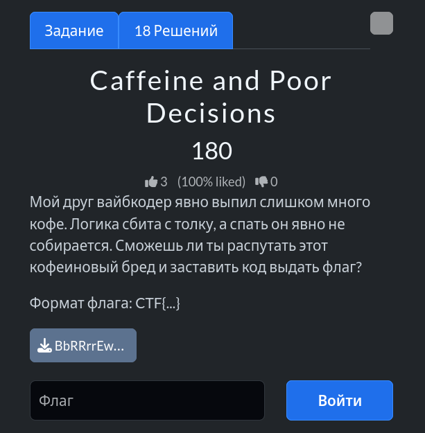

# Задание: Caffeine and Poor Decisions

## Решение

Нам дан Python-скрипт с проверкой введенной строки.

1. **Анализ условий:**
   - Длина строки `coffee` должна быть ровно **9 символов** (`len(x) == 9`).
   - Первые 3 и последние 3 символа должны состоять только из цифр (`isdigit`).
   - Итоговая строка `BREWED`, формируемая сложными манипуляциями и интерливингом строк, должна совпасть с захардкоженным `TARGET` (который расшифровывается через XOR `v ^ 0x13` в строку `"36J96a54v^__{4"`).

2. **Подбор значения:**
   - Учитывая ограничения на цифры по краям и логику работы функций шифрования/сшивания (где середина может содержать буквы, а края — цифры), подбираем валидное значение, удовлетворяющее всем условиям скрипта.
   - Подходящая строка для ввода: `123abc456`.

3. При правильном вводе скрипт успешно проходит проверку и выдает флаг: `CTF{brewed_123abc456}`.

---

**Флаг:** `CTF{brewed_123abc456}`

**Автор:** [BoCoder](https://t.me/BoCoder_Python)  
**Сообщество:** [Community DailyCTF](https://t.me/+sQe0pGRw9KdlNGI6)