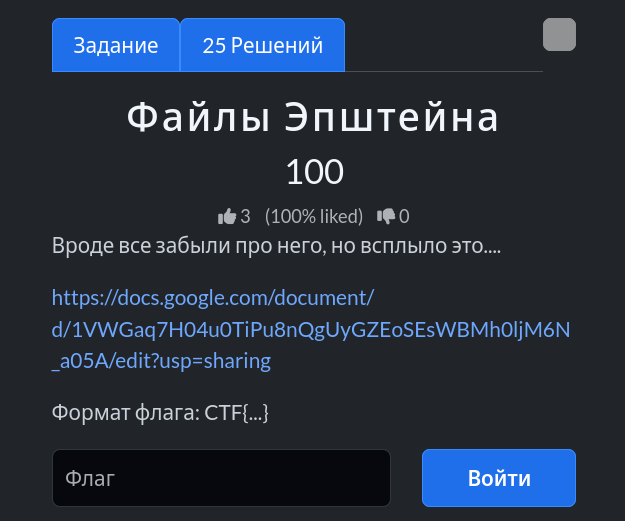

# Задание: Файлы Эпштейна

## Решение

Нам дана ссылка на Google Docs: [кусочек документа](https://docs.google.com/document/d/1VWGaq7H04u0TiPu8nQgUyGZEoSEsWBMh0ljM6N_a05A/edit?usp=sharing), где текст содержит скрытые элементы, замаскированные черным выделением (фоном):

1. **Анализ:** Переходим по ссылке и нажимаем комбинацию клавиш `Ctrl + A` (выделить всё), чтобы сбросить или подсветить скрытый под цвет фона текст.
2. При выделении всего содержимого документа становятся видны спрятанные символы:
   
3. Забираем итоговый скрытый флаг: `CTF{FILEJE!}`.

---

**Флаг:** `CTF{FILEJE!}`

**Автор:** [BoCoder](https://t.me/BoCoder_Python)  
**Сообщество:** [Community DailyCTF](https://t.me/+sQe0pGRw9KdlNGI6)