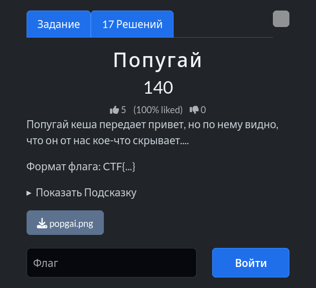
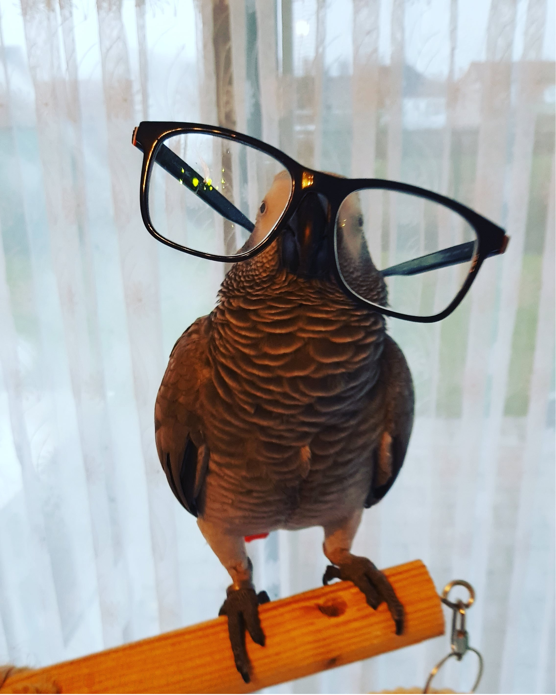
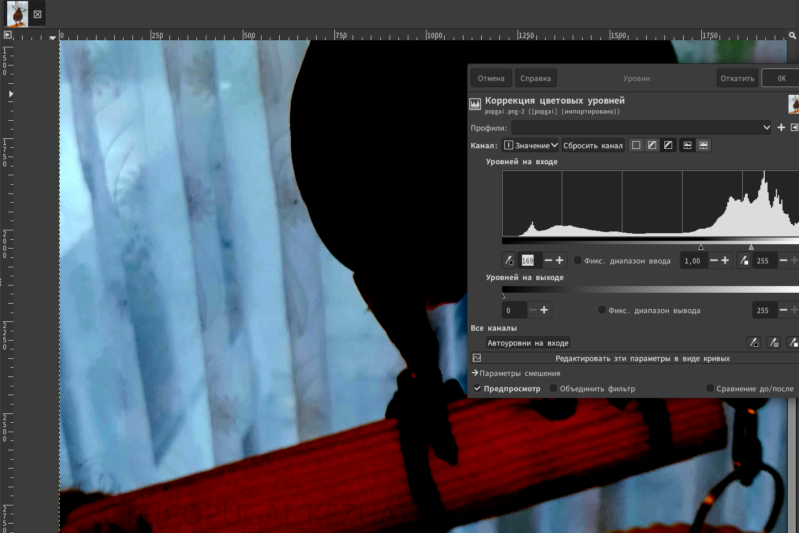

# Задание: Попугай

## Решение

Нам дано изображение:

1. **Анализ:** Скачиваем изображение и открываем его в графическом редакторе (например, GIMP) для стеганографического анализа.
2. Переходим в верхнем меню: **Цвета → Уровни** и начинаем регулировать ползунок «Уровней на входе» (сдвигаем его примерно до значения 169), чтобы проявить скрытые подшумленные или замаскированные пиксели.
3. На ветке дерева, где сидит попугай, проступает скрытая надпись с флагом:
   
   Получаем итоговый флаг: `CTF{POPUGAI_KEZHA}`.

---

**Флаг:** `CTF{POPUGAI_KEZHA}`

**Автор:** [BoCoder](https://t.me/BoCoder_Python)  
**Сообщество:** [Community DailyCTF](https://t.me/+sQe0pGRw9KdlNGI6)