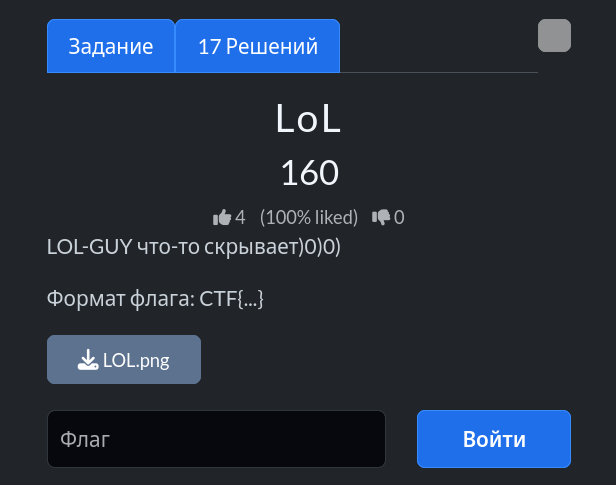
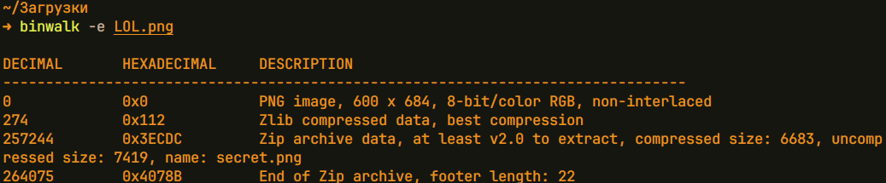
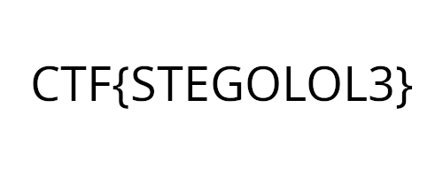

# Задание: LOL

## Решение

**Нам дано изображение:**

1. Запускаем binwalk:
binwalk -e LOL.png 

И видим, что к фото прикреплено изображение с именем secret.png
2. Смотрим результат, что команда достала и видим фото:

---

**Флаг:** `CTF{s3cr3t_d0gs_1s_h@ppy}`

**Автор:** [BoCoder](https://t.me/BoCoder_Python)  
**Сообщество:** [Community DailyCTF](https://t.me/+sQe0pGRw9KdlNGI6)