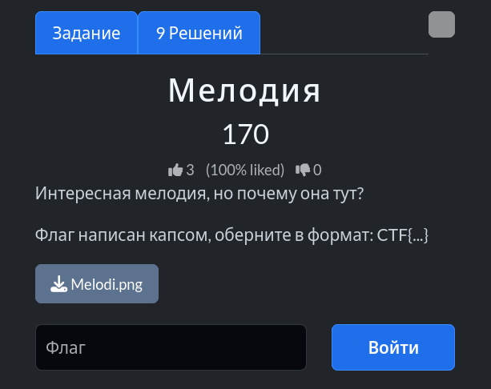
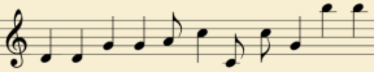
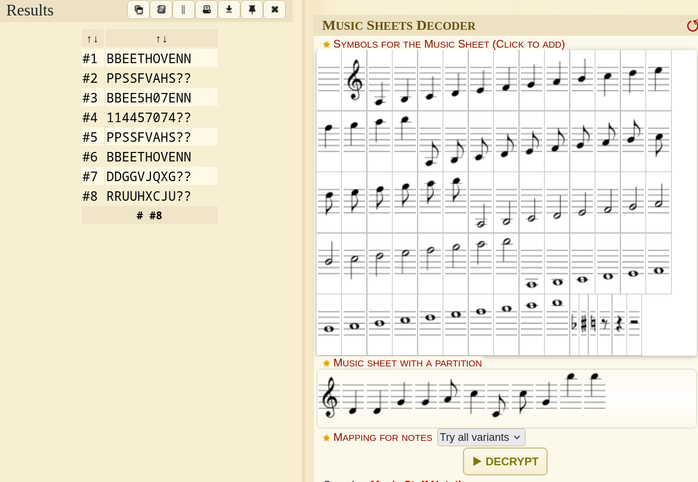

# Задание: Мелодия

## Решение

**Нам дано изображение:**

1. **Анализ:** Перед нами нотный стан с зашифрованным музыкальным шифром. Для расшифровки воспользуемся специализированным онлайн-инструментом [dCode Music Sheet Cipher](https://www.dcode.fr/music-sheet-cipher).
2. Поочередно вводим ноты в соответствии с их расположением на изображении и нажимаем кнопку расшифровки:
   
3. Получаем расшифрованное слово и оборачиваем его в требуемый формат флага: `CTF{BBEETHOVENN}`.

---

**Флаг:** `CTF{BBEETHOVENN}`

**Автор:** [BoCoder](https://t.me/BoCoder_Python)  
**Сообщество:** [Community DailyCTF](https://t.me/+sQe0pGRw9KdlNGI6)