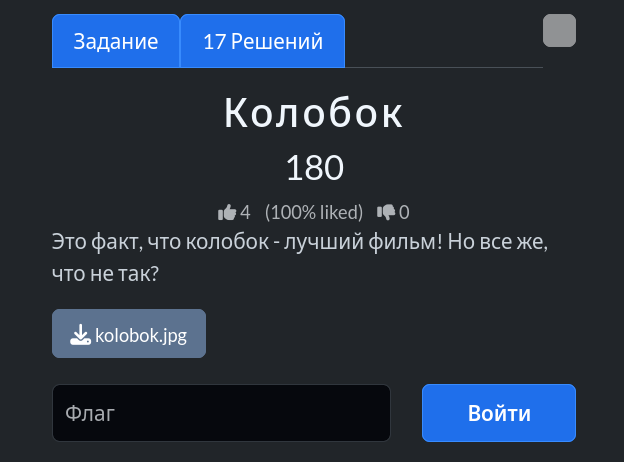
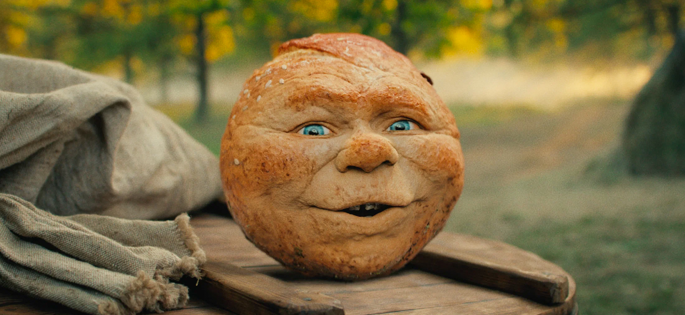
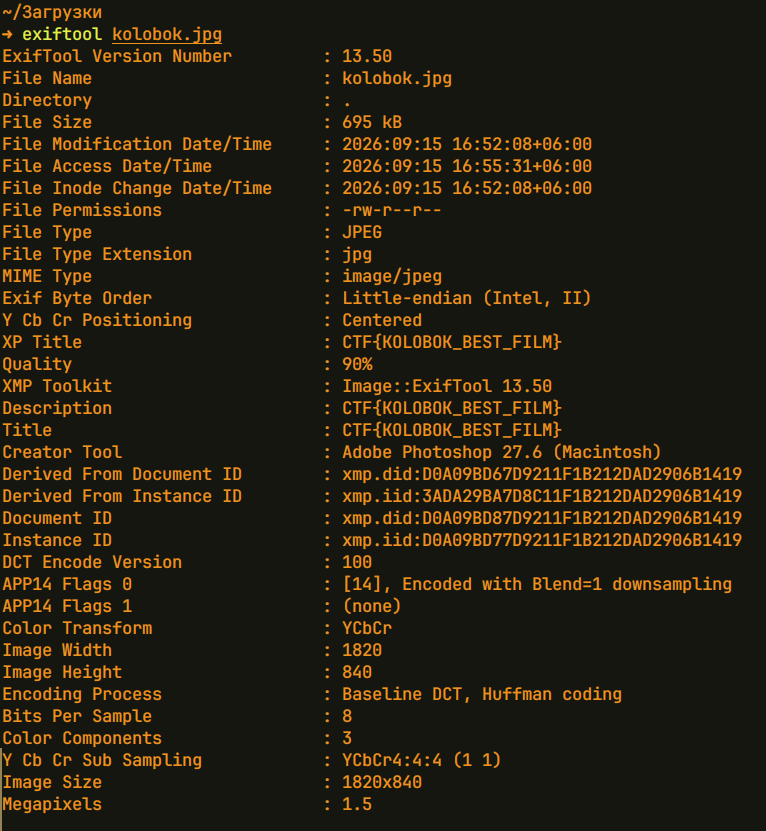

# Задание: Колобок



## Решение

**Нам дано изображение:**


1. **Анализ:** Проверяем метаданные файла с помощью утилиты `exiftool`:
   ```bash
   exiftool kolobok.jpg
   ```
   
2. В полях `Description`, `Title` и `XP Title` обнаруживаем захардкоженный флаг: `CTF{KOLOBOK_BEST_FILM}`.

---

**Флаг:** `CTF{KOLOBOK_BEST_FILM}`

**Автор:** [BoCoder](https://t.me/BoCoder_Python)  
**Сообщество:** [Community DailyCTF](https://t.me/+sQe0pGRw9KdlNGI6)
