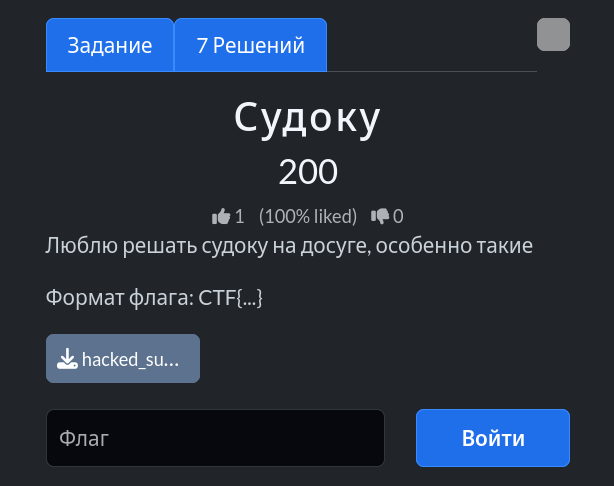
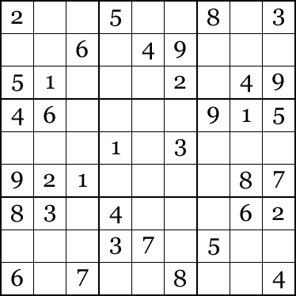
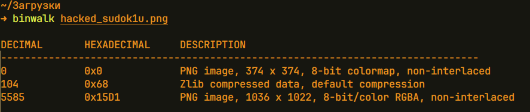
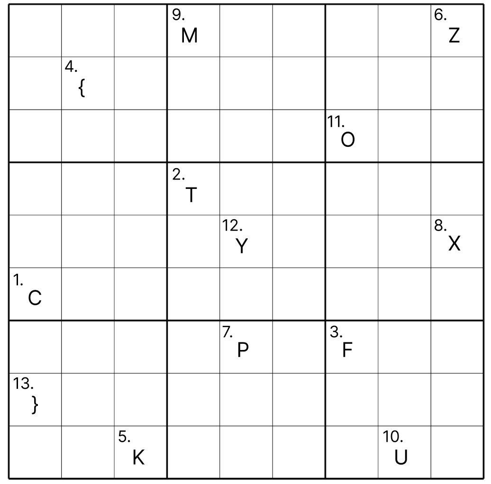

# Задание: Судоку



## Решение

**Нам дано изображение:**


1. **Анализ:** Запускаем утилиту `binwalk` для проверки скрытых данных в файле:
   ```bash
   binwalk hacked_sudok1u.png
   ```
   
   Утилита обнаруживает наличие второго внедренного PNG-изображения.
2. **Извлечение:** Извлекаем скрытый файл с помощью утилиты `dd` (пропустив первые 5585 байт контейнера):
   ```bash
   dd if=hacked_sudok1u.png of=hidden.png bs=1 skip=5585
   ```
3. Открываем полученное изображение:
   
   Сопоставляем цифры и буквы, зашифрованные на сетке судоку, и собираем итоговый флаг: `CTF{KZPXMUOY}`.

---

**Флаг:** `CTF{KZPXMUOY}`

**Автор:** [BoCoder](https://t.me/BoCoder_Python)  
**Сообщество:** [Community DailyCTF](https://t.me/+sQe0pGRw9KdlNGI6)